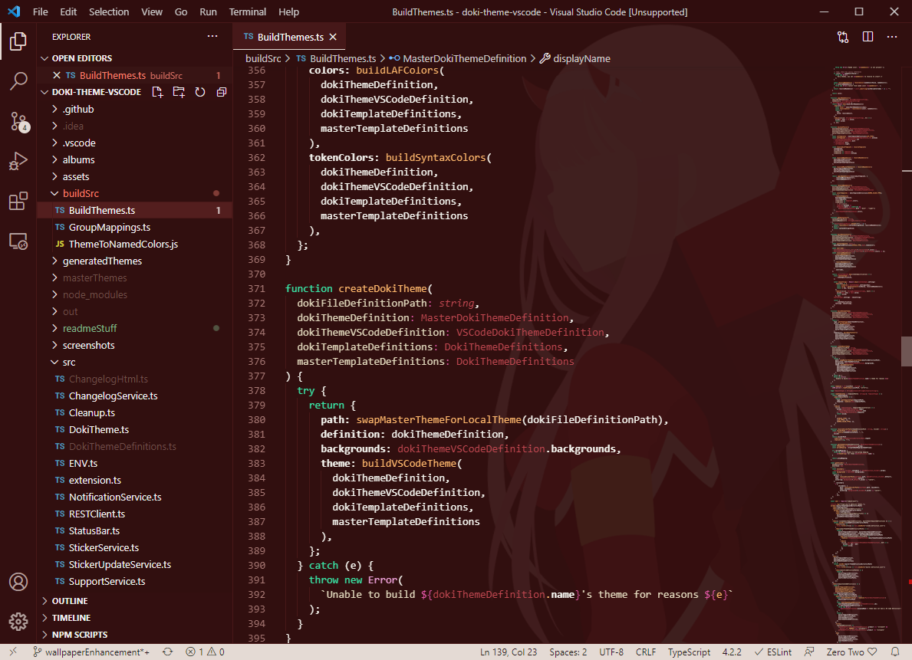
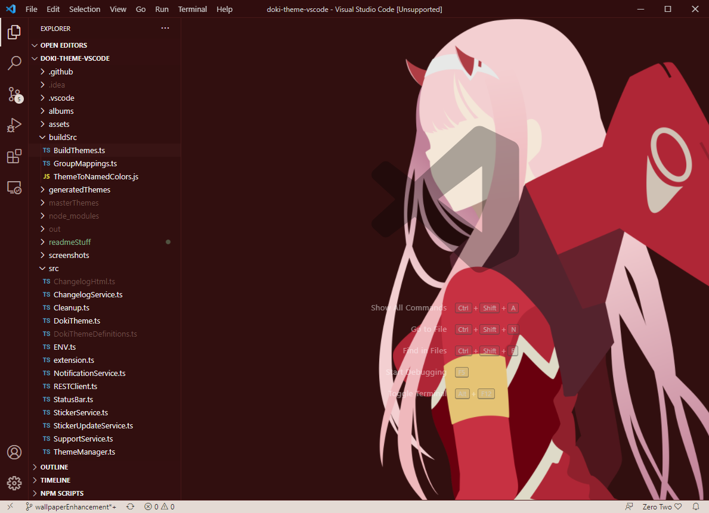
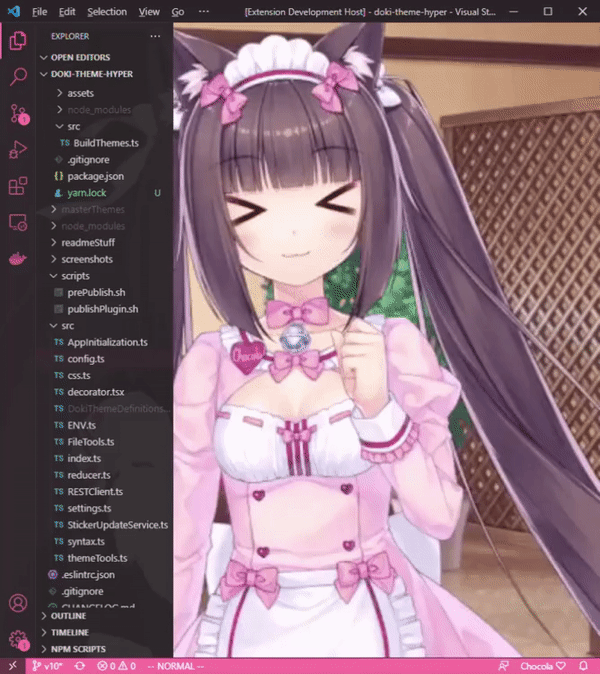
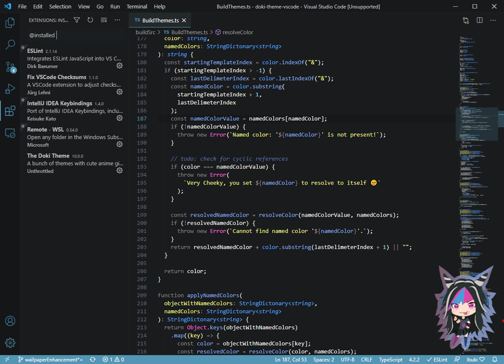
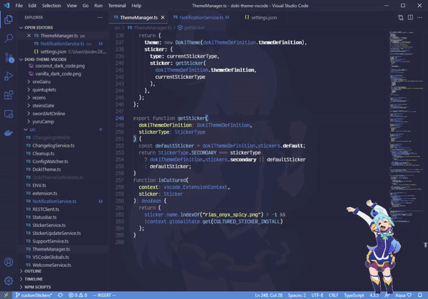
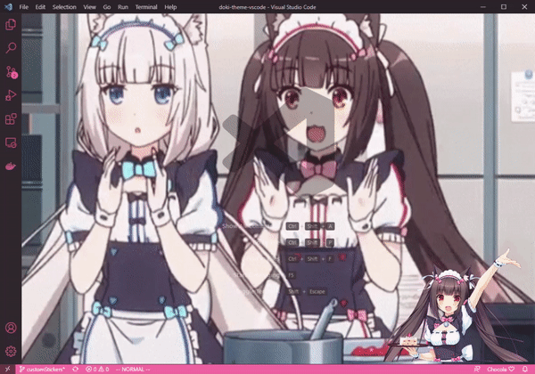
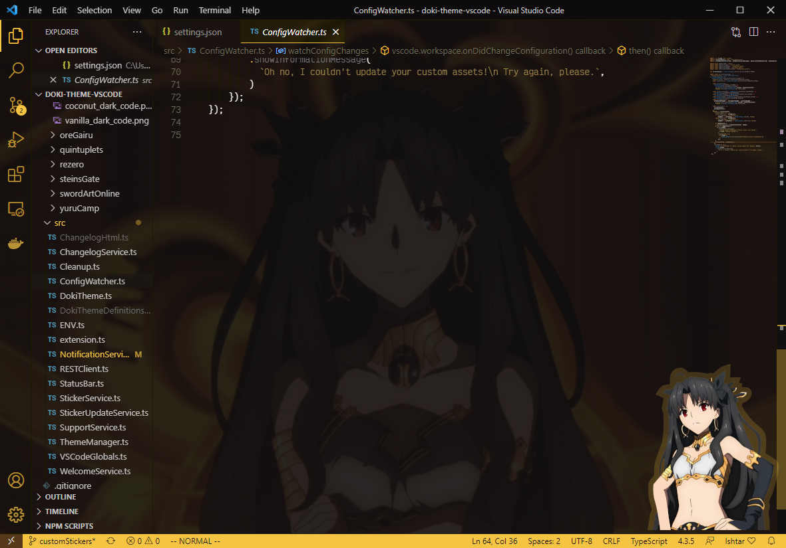
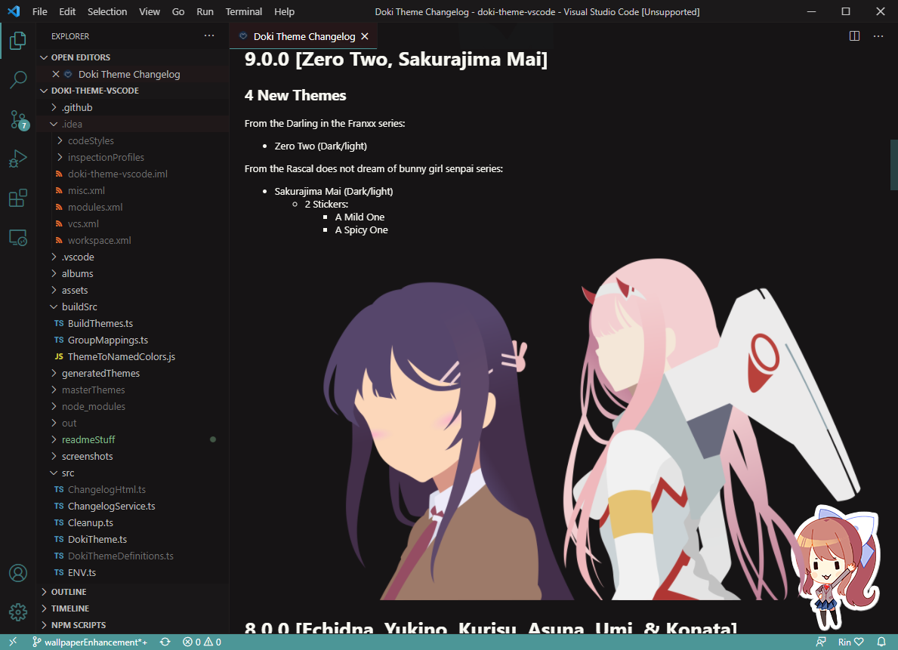

[](https://gitter.im/doki-theme-vscode/community?utm_source=badge&utm_medium=badge&utm_campaign=pr-badge)

# Feature Preview


Steps demonstrated:
1. Choose Ryuko's Color Theme
1. Enable Ryuko's wallpaper
1. Reload/Restart VSCode
1. Demonstrate glass pane feature

## Screen Samples!

# [Complete Theme Album.](albums/complete_theme_album.md)

Themes grouped [by anime](./albums/grouping.md)

## About!

This plugin is for serious Otaku programmers.
Code with your waifu. With over **50** themes,
I think you will find best girl.

You can choose themes from various, Anime, Manga, or Visual Novels:

- Blend S
- Daily life with a monster girl
- DanganRonpa
- Darling in the Franxx
- Doki-Doki Literature Club
- Don't Toy With Me, Miss Nagatoro
- Fate
- Future Diary
- Gate
- High School DxD
- Kakegurui
- Kill La Kill
- KonoSuba
- Love Live!
- Lucky Star
- Miss Kobayashi's Dragon Maid
- Monogatari
- NekoPara
- Neon Genesis Evangelion
- OreGairu
- Quintessential Quintuplets
- Rascal does not dream of bunny girl senpai
- Re:Zero
- Steins Gate
- Sword Art Online
- Yuru Camp

---

# Documentation

- [Configuration](#configuration)
    - [Background Images](#background-images)
    - [Hide VSCode Watermark](#hide-watermark)
    - [Stickers](#sticker)
    - [Custom Assets](#custom-assets)
    - [Asset Restoration](#asset-restoration)
    - [Suggestive Content](#suggestive-content)
    - [Asset Removal](#remove-assets)
    - [Show Changelog](#show-changelog)
- [Miscellaneous](#miscellaneous)
    - [Contributing](#contributing)
    - [Theme Requests](#theme-requests)
    - [Helping the community](#enjoying-the-plugin)
    - [Feature Requests](#contributions)
    - [More Doki Theme!](#even-more-doki-theme)

# Configuration

## Background Images

**Background Wallpaper** is probably one of the best features of the plugin.
This feature will set the background image to the current theme's official wallpaper.

**Important!!** Installing theme assets requires me to corrupt VS-Code by modifying CSS. You will have to use the "Remove Sticker/Background" command to restore VS Code back to supported status before unistalling. You can close VSCode and start it back up remove the annoying `Unsupported` warning. The plugin automatically fixes VSCode's checksums.

**Glass Pane effect**




## Hide Watermark

Tired of the the VSCode watermark cramping your style? 
You have the ability to hide it using **Hide VSCode Watermark**, so you can fully enjoy your art.

**Important!!** Hiding the watermark requires me to corrupt VS-Code by modifying CSS. You will have to use the "Remove Sticker/Background" command to restore VS Code back to supported status before unistalling. You can close VSCode and start it back up remove the annoying `Unsupported` warning. The plugin automatically fixes VSCode's checksums.



## Stickers

**Show sticker** allows you to control the presence of the cute sticker in the bottom right-hand corner of your IDE.

**Important!!** Installing theme assets requires me to corrupt VS-Code by modifying CSS. You will have to use the "Remove Sticker/Background" command to restore VS Code back to supported status before unistalling. You can close VSCode and start it back up remove the annoying `Unsupported` warning. The plugin automatically fixes VSCode's checksums.



## Custom Assets

Hey alright, you have the ability to set the image to be used for all the doki-themes. Allowed image types: jpg, png, gif. You'll have to put these changes in the `settings.json` in your VSCode. 

You can also use the [settings UI](https://code.visualstudio.com/docs/getstarted/settings) just search for `Doki` and you should find the relevant settings.

**Note**: All path values _must_ be an absolute path that resolves to a file on the machine running VSCode.

**Custom Sticker**

```json
"doki.sticker.path": "C:\\Users\\alex\\Downloads\\aqua_celebration.gif",
```



**Custom Background**

This is the empty editor screen (all tabs closed), the one with the VS Code watermark.

```json
"doki.background.path": "C:\\Users\\alex\\Downloads\\chocola_celebration.gif",
```



**Custom Wallpaper**

This shows up on your editor and other places. 
**Note**: you'll want to make your image partially transparent. 
Cus I was too lazy to play make all the backgrounds partially transparent to show the opaque background image. Didn't feel like peeling that onion and deviating from my color schemes.

```json
"doki.wallpaper.path": "C:\\Users\\alex\\Downloads\\ishtar.png",
```




**Custom Wallpaper/Background Anchor**

Value to be used for css 'background-position' for both the background & wallpaper (eg: center, right, left, etc.)

```json
"doki.background.anchor": "center",
```

## Asset Restoration

Unfortunately, every time VSCode updates, you will loose your installed asset changes. 
Thankfully, this plugin will remember what assets you installed, and attempt to restore them on the first detection of a VSCode update. 

If the restoration does not work the first time, you can fix the issue then run the **Restore Assets** command to quickly get you back to coding quicker! 

## Suggestive Content

<div align="center">
    </img>
</div>

So I thought it was a good idea to add a bit of culture to this plugin.
<sup><sup>Ya boi is horny on main.</sup></sup>

I will give you a bit of a warning before you install suggestive content.
Some of us are professional Otaku, who want to remain, well...professional.
Don't worry if you choose to continue, I won't ask you again for that specific theme.

Applies for the following content:

- Rias Onyx: Secondary Content


## Remove Assets

Removes both the sticker and wallpaper from your vscode and restores the original supported status.

## Show Changelog

Did you know I keep a changelog?
[You can find it here!](CHANGELOG.md)

I've also supplied a `Show Changelog` action that will bring up the changes in your VSCode!



# Miscellaneous

## Contributing

If you want to get your workstation set up to work on the plugin,
then you'll want to check out the [CONTRIBUTING.md](./CONTRIBUTING.md) for instructions on what is needed.

## Theme Requests

If you want your main squeeze to be featured in the Doki Theme suite, feel free to [submit a theme request](https://github.com/doki-theme/doki-master-theme/issues).

## Enjoying the plugin?

Great! I am glad you like it!

Be sure to ⭐ and share it with other weebs!

Also, giving it a good [review on the extension marketplace](https://marketplace.visualstudio.com/items?itemName=unthrottled.doki-theme) will help this plugin become visible to more otaku!

## Contributions?

I think your voice needs to be heard! You probably have good ideas, so feel free to submit your feedback as [an issue](https://github.com/doki-theme/doki-theme-vscode/issues/new).

Help make this plugin better!

## Even more Doki-Theme!


## JetBrains IDEs

Do you also develop using JetBrain's products (Intellij, CLion, Pycharm, etc)? 
Then be sure to install also install [the Doki Theme there as well!](https://github.com/doki-theme/doki-theme-jetbrains)


## Hyper.js

Enhance your command line experience! Install [the Doki Theme for Hyper!](https://github.com/doki-theme/doki-theme-hyper)

---

<div align="center">
    </img>
</div>
